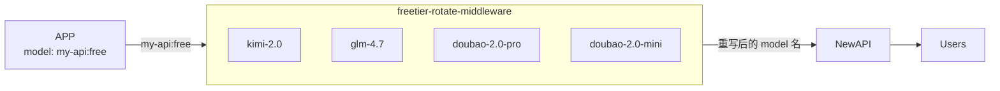

# freetier-rotate-middleware

一个面向个人免费额度聚合场景的AI网关。  

## 架构概览




## 项目定位
- 只实现 `OpenAI /v1/chat/completions` 与 `models` 相关接口。
- 不管理 provider，不管理任何上游凭据。
- 只负责路由、限额、日志、状态页与管理 API。
- 本项目作为 `newapi` 的上游地址，由 `newapi` 对外统一鉴权与计费。

## 支持的限流/配额策略
- `token_day`：按天 Token 限额（如每日 200 万 Token，指定 UTC 重置小时）。
- `req_min_day`：每分钟请求数 + 每日请求数双限额。
- 路由优先级按 `priority` 从高到低，命中可用模型即使用。
- 同优先级模型会做轮询（rotate）。

## 快速启动（Docker Compose）
1. 准备配置文件：
   `mkdir -p config && curl -fsSL https://raw.githubusercontent.com/ctxinf/freetier-rotate-middleware/main/config/config.example.jsonc -o config/config.jsonc`
2. 使用如下 `compose.yml`：

```yaml
services:
  freetier-rotate-middleware:
    image: ghcr.io/ctxinf/freetier-rotate-middleware:latest
    container_name: freetier-rotate-middleware
    ports:
      - "3001:3001"
    volumes:
      - ./config:/app/config
      - gateway-data:/app/data
    restart: unless-stopped

volumes:
  gateway-data:
```


## 配置说明
请直接参考项目中：`config/config.jsonc` 与 `config/config.example.jsonc`。
